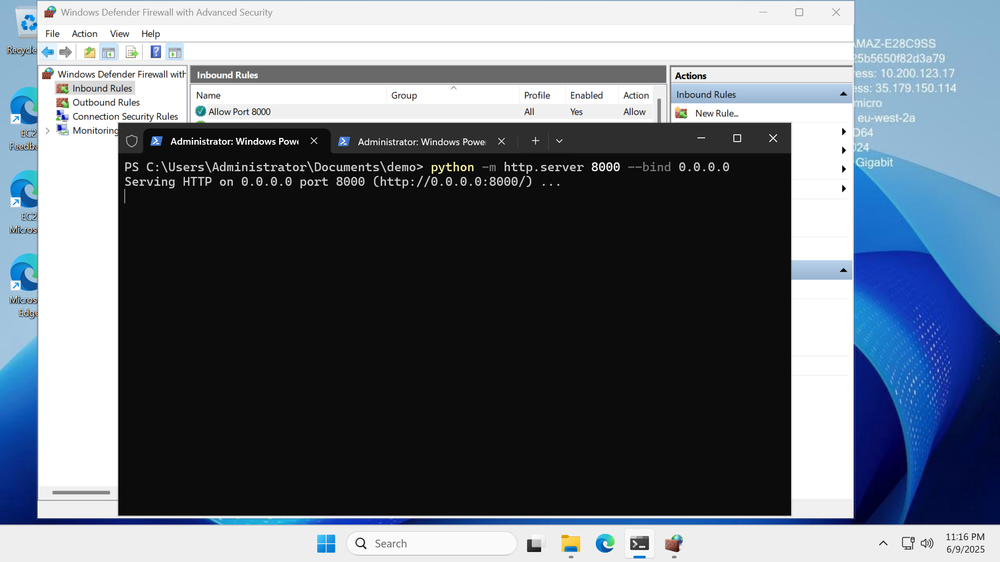
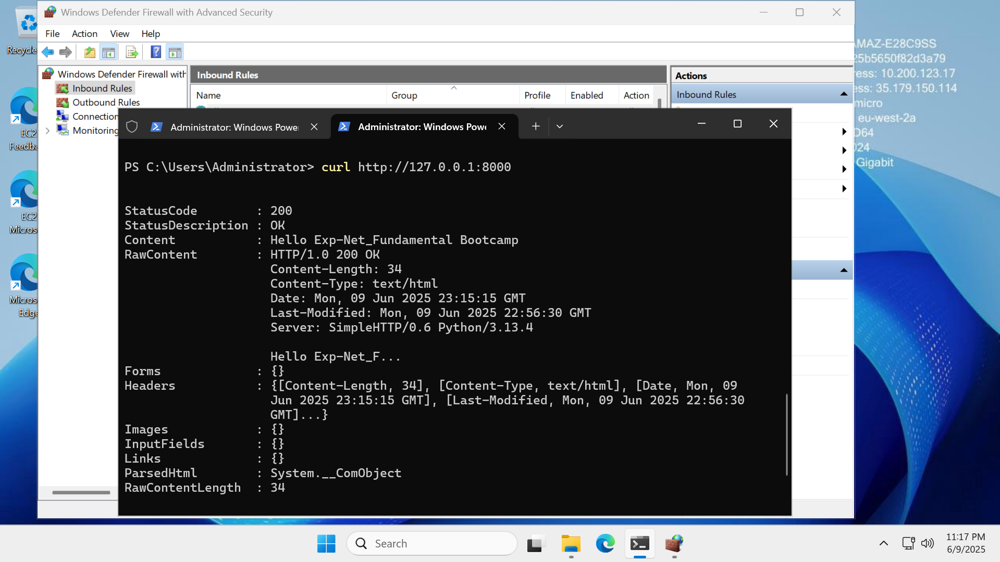
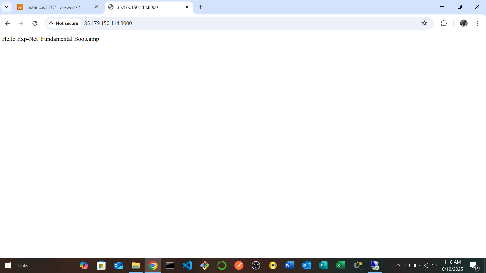

### AWS Windows Server Firewall Rules Demo
```
To accomplish the firewall rules.
- i created index.html with sample text for testing
- served it using python
- verified local access with curl
- opened port 8000 in the security group
- I access the html page from a local machine browser but in order to access port 8000 on local machine, i applied inbond firewall rule
```

### Server running with http.server


### curl test inside EC2


### index.html displayed in Local Machine browser
