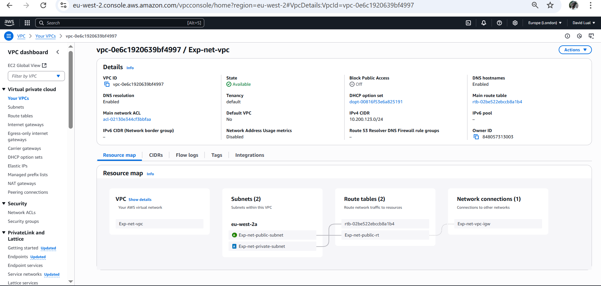

## Developer Environment

#### This is Screenshot of VPC Environment. Deployed with yaml code using CFN


#### Below is the image of an Instance with the various public and private subnets configured while creating EC2 Instance


<once sentence of what you are looking at>

## Ipconfig
#### Ipconfig command
- The Ipconfig command is showing one Ethernet adapter because i have only configured for Public Subnet

```text
<PS C:\Users\Administrator> ipconfig /all

Windows IP Configuration

   Host Name . . . . . . . . . . . . : EC2AMAZ-E28C9SS
   Primary Dns Suffix  . . . . . . . :
   Node Type . . . . . . . . . . . . : Hybrid
   IP Routing Enabled. . . . . . . . : No
   WINS Proxy Enabled. . . . . . . . : No
   DNS Suffix Search List. . . . . . : ec2.internal
                                       us-east-1.ec2-utilities.amazonaws.com
                                       eu-west-2.compute.internal
                                       eu-west-2.ec2-utilities.amazonaws.com

Ethernet adapter Ethernet:

   Connection-specific DNS Suffix  . : eu-west-2.compute.internal
   Description . . . . . . . . . . . : Amazon Elastic Network Adapter
   Physical Address. . . . . . . . . : 06-45-5F-D4-DF-17
   DHCP Enabled. . . . . . . . . . . : Yes
   Autoconfiguration Enabled . . . . : Yes
   Link-local IPv6 Address . . . . . : fe80::52f4:7442:4262:bda8%3(Preferred)
   IPv4 Address. . . . . . . . . . . : 10.200.123.17(Preferred)
   Subnet Mask . . . . . . . . . . . : 255.255.255.192
   Lease Obtained. . . . . . . . . . : Friday, June 6, 2025 8:14:46 PM
   Lease Expires . . . . . . . . . . : Friday, June 6, 2025 9:44:50 PM
   Default Gateway . . . . . . . . . : 10.200.123.1
   DHCP Server . . . . . . . . . . . : 10.200.123.1
   DHCPv6 IAID . . . . . . . . . . . : 84821943
   DHCPv6 Client DUID. . . . . . . . : 00-01-00-01-2F-D5-04-8B-06-45-5F-D4-DF-17
   DNS Servers . . . . . . . . . . . : 10.200.123.2
   NetBIOS over Tcpip. . . . . . . . : Enabled>
```

## Ping
#### Ping (www.google.com)
- Here i pinged www.google.com.

```text
<PS C:\Users\Administrator> ping www.google.com

Pinging www.google.com [142.250.180.4] with 32 bytes of data:
Reply from 142.250.180.4: bytes=32 time=1ms TTL=114
Reply from 142.250.180.4: bytes=32 time=1ms TTL=114
Reply from 142.250.180.4: bytes=32 time=1ms TTL=114
Reply from 142.250.180.4: bytes=32 time=1ms TTL=114

Ping statistics for 142.250.180.4:
    Packets: Sent = 4, Received = 4, Lost = 0 (0% loss),
Approximate round trip times in milli-seconds:
    Minimum = 1ms, Maximum = 1ms, Average = 1ms>
```

## Route
#### Below is the route print command
```text
<PS C:\Users\Administrator> route print
===========================================================================
Interface List
  3...06 45 5f d4 df 17 ......Amazon Elastic Network Adapter
  1...........................Software Loopback Interface 1
===========================================================================

IPv4 Route Table
===========================================================================
Active Routes:
Network Destination        Netmask          Gateway       Interface  Metric
          0.0.0.0          0.0.0.0     10.200.123.1    10.200.123.17     20
     10.200.123.0  255.255.255.192         On-link     10.200.123.17    276
    10.200.123.17  255.255.255.255         On-link     10.200.123.17    276
    10.200.123.63  255.255.255.255         On-link     10.200.123.17    276
        127.0.0.0        255.0.0.0         On-link         127.0.0.1    331
        127.0.0.1  255.255.255.255         On-link         127.0.0.1    331
  127.255.255.255  255.255.255.255         On-link         127.0.0.1    331
  169.254.169.123  255.255.255.255         On-link     10.200.123.17     40
  169.254.169.249  255.255.255.255         On-link     10.200.123.17     40
  169.254.169.250  255.255.255.255         On-link     10.200.123.17     40
  169.254.169.251  255.255.255.255         On-link     10.200.123.17     40
  169.254.169.253  255.255.255.255         On-link     10.200.123.17     40
  169.254.169.254  255.255.255.255         On-link     10.200.123.17     40
        224.0.0.0        240.0.0.0         On-link         127.0.0.1    331
        224.0.0.0        240.0.0.0         On-link     10.200.123.17    276
  255.255.255.255  255.255.255.255         On-link         127.0.0.1    331
  255.255.255.255  255.255.255.255         On-link     10.200.123.17    276
===========================================================================
Persistent Routes:
  None

IPv6 Route Table
===========================================================================
Active Routes:
 If Metric Network Destination      Gateway
  1    331 ::1/128                  On-link
  3     40 fd00:ec2::123/128        On-link
  3     40 fd00:ec2::250/128        On-link
  3     40 fd00:ec2::253/128        On-link
  3     40 fd00:ec2::254/128        On-link
  3    276 fe80::/64                On-link
  3    276 fe80::52f4:7442:4262:bda8/128
                                    On-link
  1    331 ff00::/8                 On-link
  3    276 ff00::/8                 On-link
===========================================================================
Persistent Routes:
  None>
```

## Trace Route
###Below is command tracert google.com
```text
<PS C:\Users\Administrator> tracert google.com

Tracing route to google.com [216.58.212.238]
over a maximum of 30 hops:

  1     *        *        *     Request timed out.
  2     1 ms     1 ms    <1 ms  151.148.9.2
  3     1 ms     1 ms    <1 ms  151.148.9.3
  4     1 ms     1 ms     1 ms  192.178.97.51
  5     2 ms     1 ms    72 ms  216.239.41.241
  6    <1 ms    <1 ms    <1 ms  lhr25s28-in-f14.1e100.net [216.58.212.238]
>
```

## Netstat
### Below is the netstat command for checking connections

```text
<PS C:\Users\Administrator> netstat

Active Connections

  Proto  Local Address          Foreign Address        State
  TCP    10.200.123.17:3389     customer:54303         ESTABLISHED
  TCP    10.200.123.17:49743    172.167.33.55:https    ESTABLISHED
  TCP    10.200.123.17:49744    172.167.33.55:https    ESTABLISHED
  TCP    10.200.123.17:63290    40.126.31.71:https     TIME_WAIT
  TCP    10.200.123.17:63291    20.190.159.73:https    ESTABLISHED
  TCP    10.200.123.17:63293    20.190.159.73:https    TIME_WAIT
  TCP    10.200.123.17:63294    20.190.159.73:https    TIME_WAIT>

  ```

